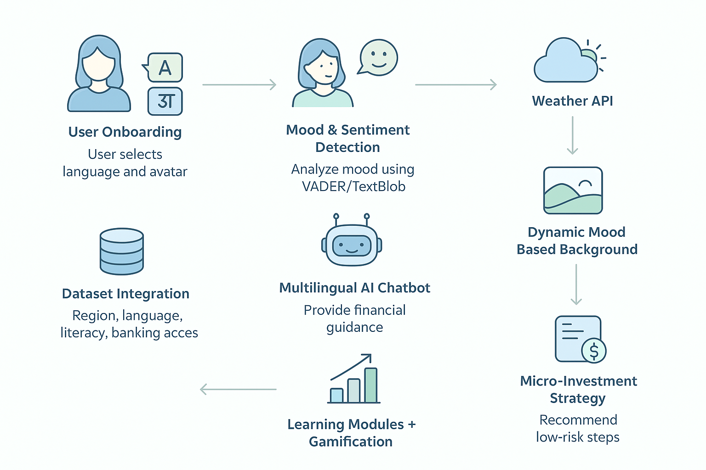
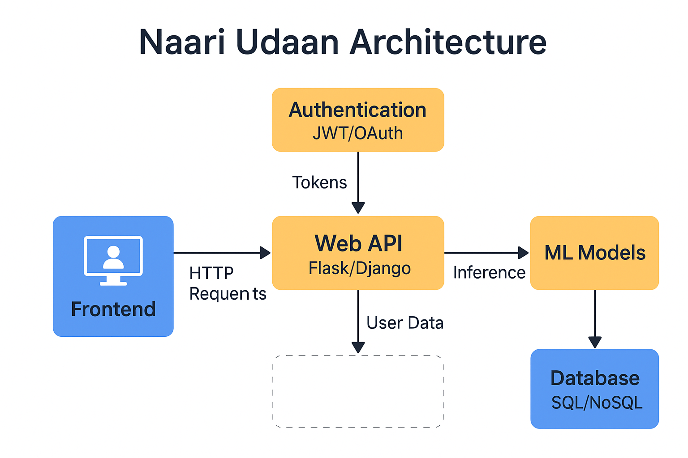

# 🌸 Naari Udaan – AI for Financial Empowerment of Rural Women

**Empowering rural women with AI-driven financial literacy, personalized guidance, and gamified learning — all in their native languages.**  
*Built for social impact, scalable deployment, and inclusive growth.*

---

## 📌 Project Overview

Naari Udaan is a multilingual AI-powered web platform that promotes financial literacy and micro-investment education among rural women in India. Combining AI chatbots, sentiment detection, and gamified modules in Hindi, Bengali, Marathi, and more, it aims to bridge knowledge gaps and foster financial independence in underserved communities.

---

## 🧠 AI-Powered Interaction Flow

### User Onboarding
- User selects preferred language and avatar.  
- Flask backend serves dynamic, localized welcome content.

### Mood & Sentiment Detection
- Users express current mood via text input.  
- Mood analyzed with VADER/TextBlob for personalized UI experience.  
- Weather API dynamically adjusts background visuals to user environment.

### Multilingual AI Chatbot
- GPT-3.5 / FLAN-T5 provides context-aware financial guidance in user’s language.  
- Conversational, simple, and tailored responses boost engagement.

### Learning Modules + Gamification
- Interactive modules and quizzes reward progress with coins and badges.  
- Decision-tree logic adapts content difficulty and suggestions.

### Micro-Investment Strategy
- Logistic regression model recommends low-risk investments based on profile and quiz data.  
- Encourages safe, achievable financial steps.

### Dataset Integration
- Cleaned 1250-entry dataset covers region, language, literacy, banking, mobile access.  
- Enables personalized, data-driven decision making.

---

## 📊 Flow Diagram

---

## 🖥 Architecture Diagram

---

## 💻 Tech Stack

| Area       | Tools / Frameworks                                            |
| ---------- | ------------------------------------------------------------ |
| Frontend   | 🌐 HTML, 🎨 Tailwind CSS, 🎨 Bootstrap, ⚡ JavaScript         |
| Backend    | 🐍 Python Flask                                              |
| AI / ML    | 🤖 GPT-3.5 / Text T5, 🧠 VADER Sentiment Analysis, 🌳 Decision Trees, 📈 Logistic Regression |
| Dataset    | 📊 pandas, 📄 CSV (cleaned 1250-entry dataset)               |
| APIs       | 🔑 OpenAI API, ☁️ Weather API                               |

---

## 📊 Sample Dataset (Preview)

| User_ID | Age | Region       | Language | Bank | Mobile | Risk   | Goal           | Quiz_Score |
|---------|-----|--------------|----------|------|--------|--------|----------------|------------|
| 001     | 28  | West Bengal  | Bengali  | Yes  | Yes    | Low    | Start Savings  | 74         |
| 002     | 34  | Maharashtra  | Marathi  | Yes  | No     | Medium | Dairy Business | 67         |

Full dataset available in `Naari_Udaan_Complete_Clean_Dataset.csv`

---

## 📈 Project Outcomes

- Personalized learning and financial empowerment for rural women  
- Localized AI copilot delivering guidance in native languages  
- Scalable platform designed for NGO and Self-Help Group deployment  
- Low-code, hackathon-ready architecture for rapid iteration and community contributions

---

## 🚀 Future Scope

- **Multilingual voice assistant:** enable hands-free access and inclusion for illiterate users  
- **SHG & NGO integration:** build partnerships to expand reach and real-world impact  
- **Offline-first mobile app:** ensure usability where internet connectivity is unreliable  
- **Micro-loan & investment partner APIs:** connect users to real financial services  
- **Advanced financial simulation tools:** help rural entrepreneurs forecast and plan business growth  
- **AI-powered fraud detection:** protect users’ investments and financial data  
- **Community-driven content updates:** empower local contributors to add region-specific modules  

---

## 🤝 Contribution Roadmap

### Good First Issues
- Add support for additional Indian languages (e.g., Telugu, Kannada)  
- Create JSON-based quiz loader with new questions  
- Write basic API route tests for Flask backend  

### Intermediate Issues
- Implement Redis caching to speed up recommendations  
- Build role-based authentication and user profiles  
- Enhance logistic regression model with feature scaling and normalization  

### Advanced Issues
- Integrate voice assistant with speech recognition and synthesis  
- Develop offline-first Progressive Web App (PWA) with sync capabilities  
- Connect to real-time microfinance and investment partner APIs for live recommendations  

---

## 👥 Contributors

- **Snigdha Saha** – Team Leader, AI & Web Development  
- **Sayantan Sahoo** – Web Development & Security S 
- **Souradeep Chakraborty** – Frontend Developer  
- **Rup Debnath** – Frontend Developer  

---

## 📬 Contact

Have questions or want to collaborate? Reach out:  
✉️ [snigdhasaha.student@gmail.com](mailto:snigdhasaha.student@gmail.com)  

---

✨ *Naari Udaan empowers rural women through inclusive, intelligent design and cutting-edge AI technology.*  
Your support and contributions can help scale this impact across India.

